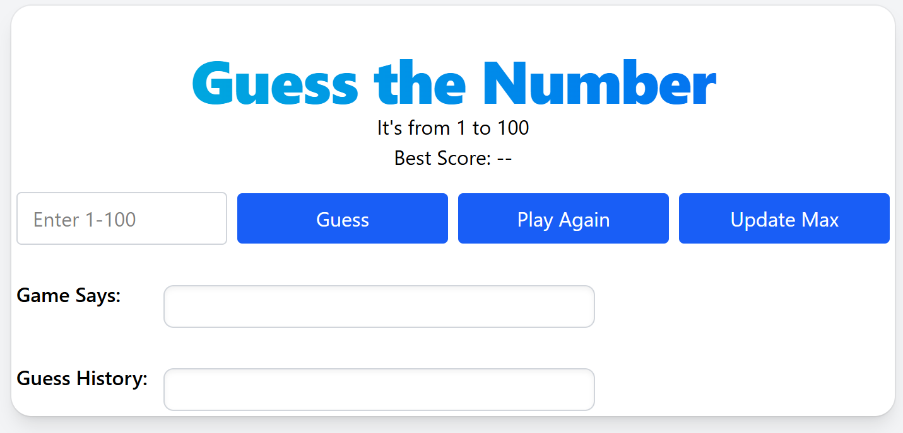
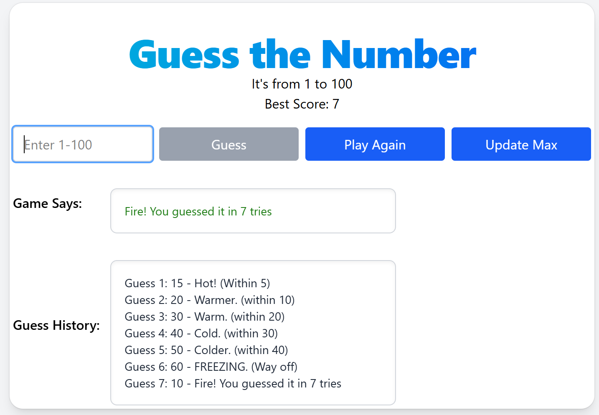
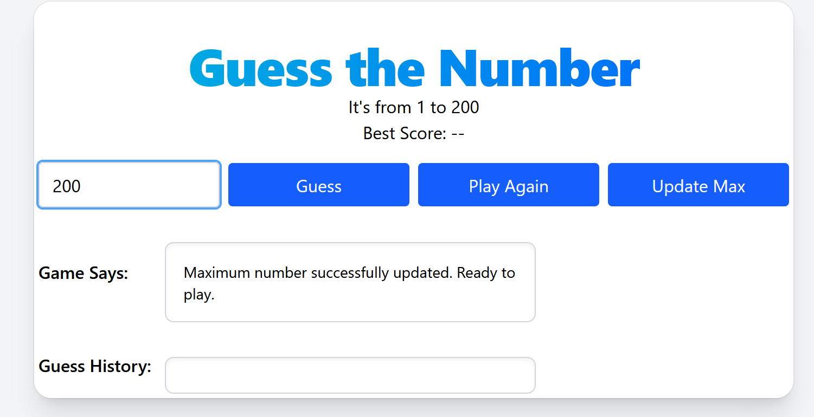
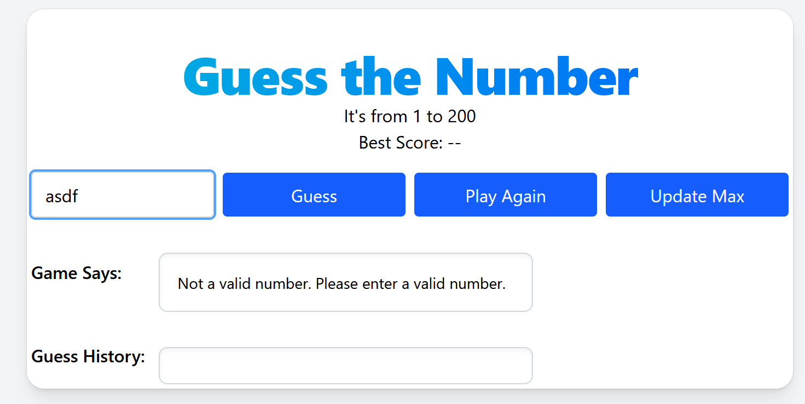
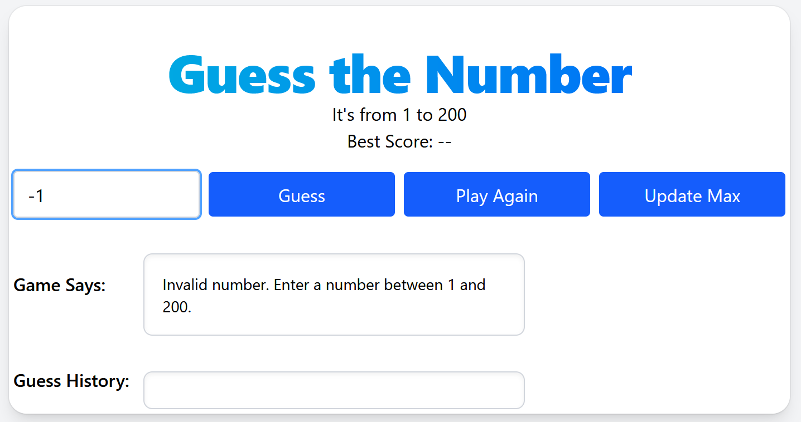
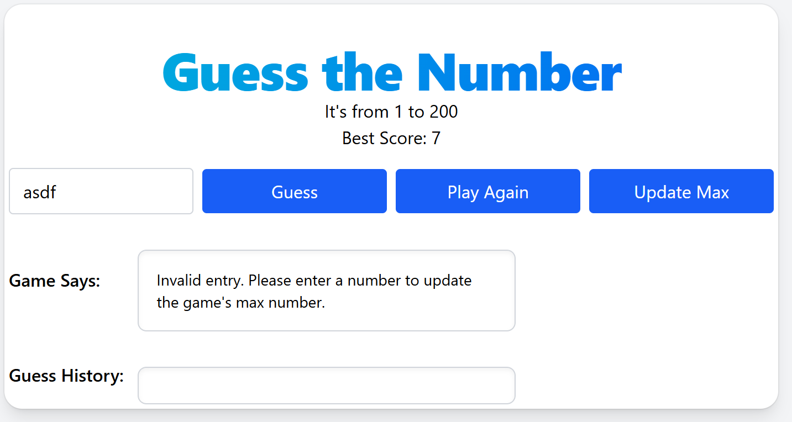
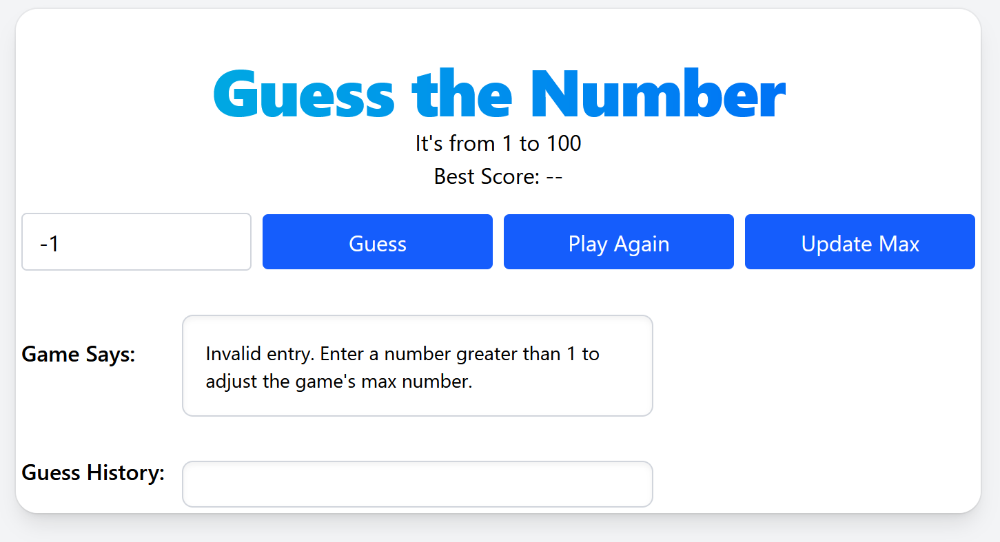

# Hot or Cold Game

## Author
[@bstearns07](https://github.com/bstearns07) Ben Stearns

## Table of Contents
- [Author](#Author)
- [Summary](#summary)
- [How Does it Work](#how-does-it-work)
- [Features](#features)
- [Topics Covered](#topics-covered)
- [Screenshots](#screenshots)
    - [Valid Entry](#valid-entry)
    - [Invalid Entry](#invalid-entry)

## Summary
### Welcome to the Hot or Cold Game
This JavaScript web app is a number guessing game. Try and guess the secret random number the game generates. 
This little game will let you know if you're so close that you're on fire🔥, or so far off that you're
freezing cold❄️. Give it a try! 
 
For full program details, please see [Program Requirements](./assets/Assignment_Instructions.pdf)

## How Does it Work
Simply open index.html to begin. 
 
Instructions:
- Type a number in the entry box that's within the range displayed (default is between 1-100)
- Click "Guess" or press "Enter" to submit your guess
- The game will tell you if you're hot or cold plus how close you are
- Keep guessing until you get it right. The game will track your guess history to help
- Click "Play Again" at any time to start a new game with a new random number
- If you'd like to make the game easier/harder, just enter a number and click "Update Max". This adjusts the maximum number 
  the game should generate to what you specified (not available in the middle of a game)
- Play as long as you like! The game will keep track of your high score

## Features
Features of this game include:
- Random number generation
- Play Again and Update Maximum number buttons
- Game output display to confirm user actions
- Game History display
- Tracks your best score
- Numeric Data Validation
- Tailwind CSS and responsive design

## Topics Covered
- DOM manipulation
- Defining functions
- Adding event listeners
- switch(true) statements
- "keydown" event listeners and element.focus() for improved user experience
- Enabling/disabling buttons
- Tailwind responsive design and animations

## Screenshots

### Valid Entry

### Invalid Entry

[Back to Top](#hot-or-cold-game)